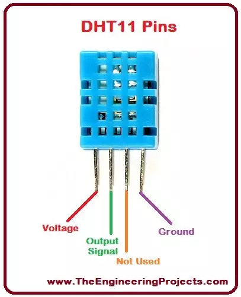
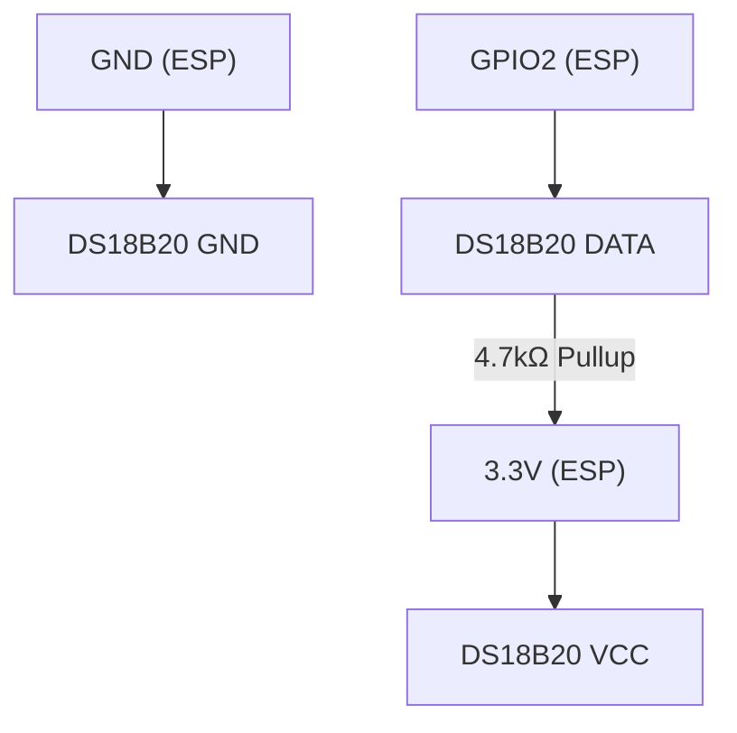

# ESP32 DHT11 Temperature Sensor

This project uses an ESP32 microcontroller and a DHT11 temperature/humidity sensor to read temperature data and make it available via a web interface.

## Project Structure

- **src/**: Contains the main application code.
- **include/**: Header files for the project.
- **lib/**: Libraries used in the project.
- **platformio.ini**: Configuration file for PlatformIO.
- **README.md**: Documentation for the project.

## Hardware Requirements

- ESP32 development board
- DHT11 temperature and humidity sensor
- Jumper wires
- Breadboard (optional)
- USB cable for connecting ESP32 to computer

## Wiring

Connect the DHT11 sensor to the ESP32 as follows:

- DHT11 VCC → ESP32 3.3V
- DHT11 GND → ESP32 GND
- DHT11 DATA → ESP32 GPIO pin 4 (can be changed in code)




    <!-- VCC --> DISPLAY_VCC["Display VCC"]
    GND --> DISPLAY_GND["Display GND"]
    SDA["GPIO4 (ESP C3)"] --> DISPLAY_SDA["Display SDA"]
    SCL["GPIO5 (ESP C3)"] --> DISPLAY_SCL["Display SCL"] -->


## Software Requirements

- PlatformIO (recommended) or Arduino IDE
- Required libraries (automatically installed by PlatformIO):
  - DHT sensor library
  - Adafruit Unified Sensor
  - WiFi (ESP32 core)
  - WebServer (ESP32 core)
  - PubSubClient (for MQTT implementation)

## Setup

1. Clone this repository
2. Copy `include/credentials.h.example` to `include/credentials.h`
3. Edit `include/credentials.h` and add your WiFi credentials:
   ```cpp
   #define WIFI_SSID "your-wifi-ssid"
   #define WIFI_PASSWORD "your-wifi-password"
   ```
4. Build and upload the project using PlatformIO:
   ```
   pio run -t upload
   ```

## Available Implementations

This project includes three different implementations:

1. **Basic Serial Output** (main.cpp) - Outputs temperature to serial monitor
2. **Web Server** (main_web_server.cpp) - Creates a web server for viewing readings in browser
3. **MQTT Client** (main_mqtt.cpp) - Publishes readings to an MQTT broker

To select which implementation to use, edit the `platformio.ini` file and update the `src_filter` directive.

## Basic Serial Output

1. Connect your ESP32 to your computer.
2. Select the correct board and port in PlatformIO.
3. Upload the code.
4. Open the Serial Monitor to view temperature and humidity readings (115200 baud but platformio should detect automatically).

## Web Server Implementation

After uploading with the web server implementation active, the ESP32 will:
1. Connect to your WiFi network
2. Create a web server accessible from any device on your network
3. Display temperature and humidity readings on a web page that refreshes every 5 seconds

To access the web server, open a web browser and navigate to the ESP32's IP address, which will be displayed in the serial monitor.

## MQTT Implementation

For the MQTT implementation, make sure to configure your MQTT broker settings in `credentials.h`:
```cpp
#define MQTT_SERVER "your-mqtt-broker.com"
#define MQTT_PORT 1883
#define MQTT_USER "mqtt_username"
#define MQTT_PASSWORD "mqtt_password"
```

This implementation publishes readings to two topics:
- `home/temperature` - Current temperature in Celsius
- `home/humidity` - Current humidity percentage

## Troubleshooting

- If no readings appear, check your wiring connections
- Ensure the DHT11 sensor is not damaged
- Verify that the correct GPIO pin is specified in the code
- For WiFi connection issues, check your credentials in `credentials.h`
- For MQTT issues, verify your broker settings and connectivity

## Last Updated

May 16, 2025


Hardware:
Übersicht
Berichtpunkt
Dieser Bildschirm unterscheidet sich von anderen 0,42-Zoll-Bildschirmen.Der Ausgangspunkt des Bildschirms lautet 12864 (13, 14)

Bitte achten Sie vor dem Kauf darauf, andere 0,42-Zoll-Bildschirme dürfen nicht direkt ersetzen


Produkteinführung

Das SP32 C3 OLED-Entwicklungsboard basiert auf ESP32C3FN4/FH4, das Kernplatinen entworfen und hergestellt wird.

Es verfügt über einen integrierten 4M-Flash.Es verfügt über zwei Modi: WLAN und Bluetooth, mit Keramikantenne,

Ausgestattet mit einem 0,42-Zoll-OLED-Bildschirm und unterstützt USB-Download.


https://steinlaus.de/esp32-c3-mit-0-42-inch-lcd-hello-world/