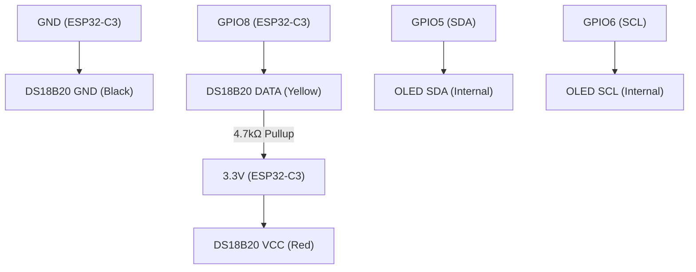

# ESP32 Temperature Sensor Collection

This project contains multiple temperature sensor implementations for ESP32 microcontrollers, including DHT11 and DS18B20 sensors with various output methods (serial, web server, MQTT, and OLED display).

## Project Structure

- **src/**: Contains the main application code
  - `main.cpp` - Basic DHT11 serial output
  - `main_web_server.cpp` - DHT11 with web interface
  - `main_mqtt.cpp` - DHT11 with MQTT publishing
  - `main_ds18b20.cpp` - DS18B20 with OLED display
  - `main_chip_test.cpp` - Basic ESP32-C3 functionality test
- **include/**: Header files for the project
- **lib/**: Libraries used in the project
- **platformio.ini**: Configuration file for PlatformIO with multiple environments
- **README.md**: This documentation

## Hardware Configurations

### 1. ESP32 with DHT11 Sensor
- ESP32 development board
- DHT11 temperature and humidity sensor
- Jumper wires
- Breadboard (optional)

### 2. ESP32-C3 OLED Board with DS18B20
- ESP32-C3 OLED development board (with integrated 0.42" OLED display)
- DS18B20 waterproof temperature sensor
- 4.7kΩ pull-up resistor
- Jumper wires

## Wiring Diagrams

### DHT11 Configuration
```
DHT11 VCC → ESP32 3.3V
DHT11 GND → ESP32 GND
DHT11 DATA → ESP32 GPIO4
```

### DS18B20 with ESP32-C3 OLED Board


**Note**: The ESP32-C3 OLED board has an integrated 0.42" OLED display (72x40 pixels) that uses I2C communication on GPIO5 (SDA) and GPIO6 (SCL).

## Software Requirements

- PlatformIO (recommended) or Arduino IDE
- Required libraries (automatically installed by PlatformIO):
  - DHT sensor library
  - Adafruit Unified Sensor
  - WiFi (ESP32 core)
  - WebServer (ESP32 core)
  - PubSubClient (for MQTT implementation)
  - OneWire (for DS18B20)
  - DallasTemperature (for DS18B20)
  - U8g2 (for OLED display)

## Available Implementations

### 1. Basic DHT11 Serial Output (`main.cpp`)
**Environment**: `esp32dev`
- Outputs temperature and humidity to serial monitor
- Simple debugging and testing

### 2. DHT11 Web Server (`main_web_server.cpp`)
**Environment**: `esp32dev`
- Creates a web server for viewing readings in browser
- Auto-refreshing web interface
- Requires WiFi credentials

### 3. DHT11 MQTT Client (`main_mqtt.cpp`)
**Environment**: `esp32dev`
- Publishes readings to MQTT broker
- Topics: `home/temperature` and `home/humidity`
- Requires WiFi and MQTT broker configuration

### 4. DS18B20 with OLED Display (`main_ds18b20.cpp`)
**Environment**: `ds18b20`
- Digital temperature sensor with waterproof probe
- Real-time display on integrated OLED
- Large font temperature display in Celsius
- Visual sensor status indication

### 5. ESP32-C3 Chip Test (`main_chip_test.cpp`)
**Environment**: `chip-test`
- Basic functionality test for ESP32-C3 boards
- LED blinking test
- System information output
- Useful for hardware verification

## Setup Instructions

### 1. Clone and Configure
```bash
git clone <repository-url>
cd temperature-sensor
```

### 2. WiFi Configuration (for web/MQTT implementations)
Copy `include/credentials.h.example` to `include/credentials.h` and edit:
```cpp
#define WIFI_SSID "your-wifi-ssid"
#define WIFI_PASSWORD "your-wifi-password"
#define MQTT_SERVER "your-mqtt-broker.com"  // For MQTT only
#define MQTT_PORT 1883
#define MQTT_USER "mqtt_username"
#define MQTT_PASSWORD "mqtt_password"
```

### 3. Build and Upload

#### For DHT11 implementations (ESP32):
```bash
# Basic serial output
pio run -e esp32dev -t upload

# Web server (modify src_filter in platformio.ini)
pio run -e esp32dev -t upload

# MQTT (modify src_filter in platformio.ini)
pio run -e esp32dev -t upload
```

#### For DS18B20 with ESP32-C3 OLED:
```bash
pio run -e ds18b20 -t upload --upload-port=/dev/ttyACM0
pio device monitor -p /dev/ttyACM0 -b 115200
```

#### For ESP32-C3 testing:
```bash
pio run -e chip-test -t upload --upload-port=/dev/ttyACM0
pio device monitor -p /dev/ttyACM0 -b 115200
```

## Environment Configuration

The `platformio.ini` file contains multiple environments:

- **`esp32dev`**: Standard ESP32 with DHT11 sensor
- **`ds18b20`**: ESP32-C3 OLED board with DS18B20 sensor
- **`chip-test`**: ESP32-C3 basic functionality test

To switch between implementations, modify the `src_filter` in the desired environment or use the specific environment flag when building.

## Features by Implementation

| Implementation | Temperature | Humidity | Display | Network | Sensor Type |
|---------------|-------------|----------|---------|---------|-------------|
| Basic Serial | ✅ | ✅ | Serial | ❌ | DHT11 |
| Web Server | ✅ | ✅ | Web Browser | WiFi | DHT11 |
| MQTT | ✅ | ✅ | MQTT Client | WiFi | DHT11 |
| DS18B20 OLED | ✅ | ❌ | OLED Screen | ❌ | DS18B20 |
| Chip Test | ❌ | ❌ | Serial + LED | ❌ | None |

## Troubleshooting

### General Issues
- Check wiring connections
- Verify correct GPIO pins in code
- Ensure sensor is not damaged
- Check power supply (3.3V for sensors)

### DHT11 Specific
- DHT11 requires brief delay between readings
- Check for loose connections on breadboard
- Verify DATA pin assignment matches code

### DS18B20 Specific
- **Must have 4.7kΩ pull-up resistor** between DATA and VCC
- Check for proper waterproof sensor connections
- Verify OneWire library can detect sensor
- Use serial monitor to debug sensor detection

### ESP32-C3 OLED Board
- Ensure correct board selection: `esp32-c3-devkitm-1`
- OLED display uses fixed I2C pins (GPIO5/GPIO6)
- USB-C connection required for programming
- Press reset button if upload fails

### WiFi/Network Issues
- Verify credentials in `credentials.h`
- Check WiFi signal strength
- Ensure MQTT broker is accessible (for MQTT implementation)
- Monitor serial output for connection status

## Hardware Notes

### ESP32-C3 OLED Board Specifications
- **MCU**: ESP32-C3FN4/FH4
- **Flash**: 4MB integrated
- **Connectivity**: WiFi + Bluetooth
- **Display**: 0.42" OLED (72x40 pixels)
- **Interface**: USB-C for programming
- **Antenna**: Ceramic antenna integrated

The OLED display starting point is at coordinates (13, 14) and differs from standard 0.42" displays.

## Last Updated

August 5, 2025


Also added frontend to view iot data

## References

- [ESP32-C3 OLED Board Tutorial](https://steinlaus.de/esp32-c3-mit-0-42-inch-lcd-hello-world/)
- [DS18B20 Documentation](https://www.maximintegrated.com/en/products/sensors/DS18B20.html)
- [U8g2 Library Documentation](https://github.com/olikraus/u8g2)